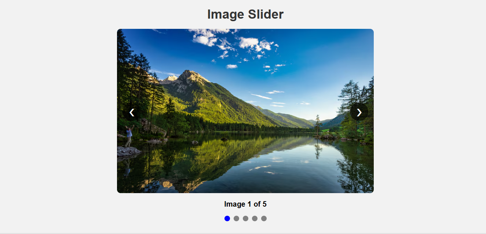

# 🖼️ Image Slider Project

A simple and responsive **Image Slider** built using **HTML, CSS, and JavaScript**. This project allows users to navigate through images using **Next**, **Previous**, and **Navigation Dots**.

---

## 📌 Features

- ✅ Next & Previous Navigation Buttons
- ✅ Dynamic Navigation Dots
- ✅ Active Dot Highlight
- ✅ Image Counter (Image 1 of 5)
- ✅ Responsive Layout
- ✅ Clean and Beginner-Friendly Code

---

## 🛠️ Technologies Used

- HTML5
- CSS3
- JavaScript (Vanilla JS)

---

## 📂 Project Structure

```
Image-Slider/
│
├── index.html
├── Image-Slider.js
├── README.md
│
└── Image/
    ├── image-1.avif
    ├── image-2.avif
    ├── image-3.avif
    ├── image-4.avif
    └── image-5.avif
```

---

## 🚀 How to Run

1. Download or Clone this repository.

```bash
git clone https://github.com/bambhaniyadhara14/Image-Slider.git
```

2. Open the project folder.

3. Open **index.html** in your browser.

That's it! 🎉

---


## 📷 Screenshot

```

```

---

## 🎥 Project Demo Video

Watch the project demo here:

👉 **https://drive.google.com/file/d/1O5KhQ8x5hMLK5_T0xIDycr9-amlWvtXv/view?usp=sharing**


---

## ⚙️ JavaScript Functions

### createDots()

Creates navigation dots dynamically according to the number of images.

### showImage()

Displays the selected image and updates the counter and active dot.

### nextSlide()

Moves to the next image. If the last image is reached, it starts again from the first image.

### prevSlide()

Moves to the previous image. If the first image is reached, it goes to the last image.

### updateCounter()

Displays the current image number.

Example:

```
Image 3 of 5
```

### updateDots()

Highlights the active navigation dot.

---

## 💡 Future Improvements

- Auto Slide
- Play / Pause Button
- Keyboard Navigation
- Swipe Support (Mobile)
- Smooth Fade Animation
- Thumbnail Navigation

---

## 👨‍💻 Author

**Dhara Bambhaniya**

GitHub: https://github.com/bambhaniyadhara14

---

## ⭐ Support

If you like this project, don't forget to **Star ⭐ the repository**.